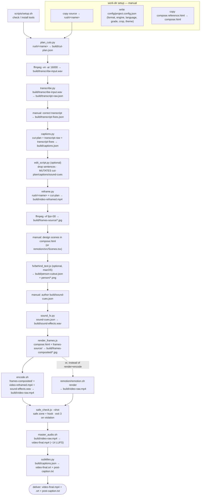
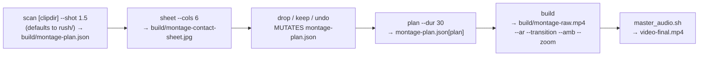

# Pipeline — stage order and data flow

Scripts are **not** numbered. The order lives here and in `video-editor/SKILL.md`.
Every script takes `<work>` (the video's work directory) as its first argument and
reads/writes its files there, split across `rush/` / `config/` / `build/` + the root
deliverable — see [design/file-layout.md](design/file-layout.md).

Python scripts are invoked as **`uv run scripts/<name>.py <work>`** (uv resolves the
skill's `.venv/`, syncing it on demand). Node scripts as `node scripts/<name>.js`, shell
steps as `bash scripts/<name>.sh`. See [design/execution.md](design/execution.md).

`scripts/PIPELINE.md` is a thin pointer to this document.

**The stage order is also data.** [`scripts/pipeline/reel-speech.json`](../video-editor/scripts/pipeline/reel-speech.json)
and `broll-montage.json` hold the same order in machine-readable form;
[`scripts/run.py`](scripts/run.md) reads them to run the mechanical stages and stop at the
human decision points (transcript correction, sentence trimming, scene design, sound
cues). This table and `SKILL.md` are the prose mirror — keep the three in sync. See
[design/orchestrator.md](design/orchestrator.md).

## Speech-ad mode (default)

### Diagram

### Stage table

| # | Script | Input → Output | Notes |
|---|--------|----------------|-------|
| 0 | [`setup.sh`](scripts/setup.md) | — | installs ffmpeg / node / uv (system), then `uv sync` + `npm ci` (isolated; `npm` brings its own Chromium) |
| — | *work-dir setup* | copy source into `rush/`; write `config/project.config.json`; copy `compose.reference.html` → `compose.html`, `studio.html` | manual |
| 1 | [`plan_cuts.py`](scripts/plan_cuts.md) | `rush/<name>` → `build/cut-plan.json` | ffmpeg `silencedetect`; source resolved via [`lib/rush.py`](scripts/lib-rush.md) |
| 2 | *extract audio* | `rush/<name>` → `build/transcribe-input.wav` | `ffmpeg -vn -ac 1 -ar 16000 -y build/transcribe-input.wav` |
| 3 | [`transcribe.py`](scripts/transcribe.md) | `build/transcribe-input.wav` → `build/transcript-raw.json` | `--language ar\|fr\|en\|ar-MA…` · faster-whisper GPU/CPU ← whisper |
| 4 | *correct transcript* | `build/transcript-raw.json` → `build/transcript-fixes.json` | Claude fixes every sentence with the user; word count per sentence must match Whisper's |
| 5 | [`captions.py`](scripts/captions.md) | `cut-plan` + `transcript-raw` + `transcript-fixes` → `build/captions.json` | per-word timing on the compressed timeline |
| 5.5 | [`edit_script.py`](scripts/edit_script.md) | `build/captions.json` (+ `cut-plan.json`, `sound-cues.json`) | `show` · `dupes` · `drop`/`keep`/`undo` · `apply`. **Before** scene design — it shifts all times |
| 6 | [`reframe.py`](scripts/reframe.md) | `rush/<name>` + `build/cut-plan.json` → `build/video-reframed.mp4` | cut + 9:16 reframe (accepts landscape; **16:9 for `format:"long"`**) + per-segment zoom + bt709 tag |
| — | *extract frames* | `build/video-reframed.mp4` → `build/frames-source/*.jpg` | `ffmpeg -i video-reframed.mp4 -vf fps=30 -q:v 3 frames-source/%05d.jpg` |
| 7 | *design scenes* | edit `<work>/compose.html` | rewrite the scene functions; each is a visual metaphor for what's said |
| 7.5/7.6 | [`fx/behind_text.js`](scripts/fx-behind_text.md) | `build/captions.json` + `frames-source/` → `build/person-cutout.json` + `person-cutout/person/*.png` | macOS only. `build` / `cutout` / `headout`. Then re-render the window |
| 8 | [`sound_fx.py`](scripts/sound_fx.md) | `build/sound-cues.json` → `build/sound-effects.wav` | numpy-synthesized whoosh / thud / tap |
| 9a | [`render_frames.js`](scripts/render_frames.md) | `compose.html` + `frames-source/` → `build/frames-composited/*.jpg` | `all` (resume) · `range a b` · `preview t…` · `--force` |
| 9a | [`encode.sh`](scripts/encode.md) | `frames-composited/` + `video-reframed.mp4` + `sound-effects.wav` → `build/video-raw.mp4` | h264 crf 21, aac 160k |
| 9b | [`remotion/remotion.sh`](scripts/remotion-remotion_sh.md) | `build/captions.json` + assets → `build/video-raw.mp4` | replaces 9a if the user edits visually |
| 10 | [`safe_check.js`](scripts/safe_check.md) | `frames-composited/` (or `compose.html`) → verdict (+ `build/safe-zone-check.jpg` only on violation) | Instagram safe zone + hook, reused for every short-form platform; **exit 3** on violation |
| 11 | [`encode.sh`](scripts/encode.md) | (done in 9a) | |
| 12 | [`master_audio.sh`](scripts/master_audio.md) | `build/video-raw.mp4` → `video-final.mp4` | −14 LUFS (+ optional `rush/bg-audio.mp3` ducked under speech) |
| 13 | [`subtitles.py`](scripts/subtitles.md) | `build/captions.json` → `video-final.srt` + `post-caption.txt` | subtitles + full text for the post caption |

**Pre-delivery checks (mandatory).** `safe_check.js --shot`; re-transcribe the output
(`build/fa.wav` → `build/fa.json`) and compare sentence starts to `build/captions.json`
(< 0.1 s drift); audio ≈ −14 LUFS / −1.5 dBTP; a real 6-shot contact sheet; file size < 30 MB.

### Utilities

- [`contact_sheet.sh`](scripts/contact_sheet.md) — one horizontal contact sheet from
  several timestamps (token economy — Claude reads one image, not N).
- [`studio.html`](scripts/studio_html.md) — standalone browser scrubber for the light
  engine (`uv run python -m http.server 8791 --directory <work>` then `/studio.html`).

## Montage mode (independent — no speech)

All commands are subcommands of [`montage_mode.py`](scripts/montage_mode.md). Clips live
in `rush/` (scanned by default — pass a folder explicitly to scan somewhere else instead).
`master_audio.sh` on the result needs `rush/bg-audio.mp3` — a montage with no ambience is a
silent track. Same deliverable name (`video-final.mp4`) as the speech-ad flow.

## Long-form mode (`format: "long"` — YouTube, 16:9)

A third world, selected by `project.config.json` `format: "long"` (not inferred from
`rush/`). `join → cut → audio → transcribe → ⟨fix⟩ → captions → ⟨tighten⟩ → ⟨chapters⟩ →
⟨broll⟩ → reframe → assemble → master → subs` — see
[`scripts/pipeline/long-form.json`](../video-editor/scripts/pipeline/long-form.json) and
the full spec in [design/long-form.md](design/long-form.md), the operator flow in
[`SKILL.md`](../video-editor/SKILL.md)'s "Long-form mode" section. No motif/scene layer, no
sound cues, no safe-zone check. **Pass 6 complete** (#84–#89): [`join_takes.py`](scripts/join_takes.md),
[`tighten.py`](scripts/tighten.md), the `reframe.py` 16:9 branch,
[`assemble_longform.py`](scripts/assemble_longform.md), chapters in
[`subtitles.py`](scripts/subtitles.md). Owed: one full run on a real ≥ 20-minute recording.

## Shared helpers

[`lib/platform.sh`](scripts/lib-platform.md) (shell) · [`lib/platform.js`](scripts/lib-platform.md)
(Node) — OS detection, path handling, Chrome discovery, `file://` URLs. If these are
current, nothing else hard-codes a path or a Chrome location.

[`lib/config.py`](scripts/lib-config.md) / `.js` — reads/merges `project.config.json`.
[`lib/rush.py`](scripts/lib-rush.md) — resolves the input file(s) in `rush/` without
assuming a fixed name.
