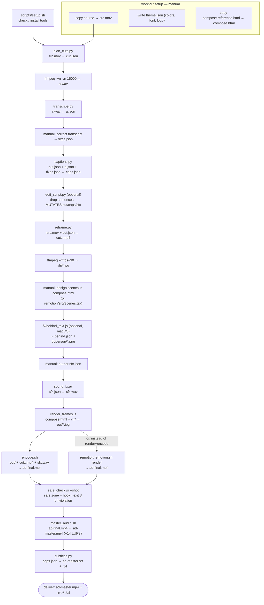
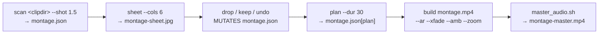

# Pipeline — stage order and data flow

Scripts are **not** numbered. The order lives here and in `video-editor/SKILL.md`.
Every script takes `<work>` (the video's work directory) as its first argument and
reads/writes its files there.

`scripts/PIPELINE.md` is a thin pointer to this document.

## Speech-ad mode (default)

### Diagram

### Stage table

| # | Script | Input → Output | Notes |
|---|--------|----------------|-------|
| 0 | [`setup.sh`](scripts/setup.md) | — | checks / installs ffmpeg, node, numpy, a Whisper engine, Chrome, puppeteer-core |
| — | *work-dir setup* | copy `src.mov`; write `theme.json`; copy `compose.reference.html` → `compose.html`, `studio.html` | manual |
| 1 | [`plan_cuts.py`](scripts/plan_cuts.md) | `src.mov` → `cut.json` | ffmpeg `silencedetect` |
| 2 | *extract audio* | `src.mov` → `a.wav` | `ffmpeg -vn -ac 1 -ar 16000 -y a.wav` |
| 3 | [`transcribe.py`](scripts/transcribe.md) | `a.wav` → `a.json` | `--language ar\|fr\|en\|ar-MA…` · faster-whisper GPU/CPU ← whisper |
| 4 | *correct transcript* | `a.json` → `fixes.json` | Claude fixes every sentence with the user; word count per sentence must match Whisper's |
| 5 | [`captions.py`](scripts/captions.md) | `cut.json` + `a.json` + `fixes.json` → `caps.json` | per-word timing on the compressed timeline |
| 5.5 | [`edit_script.py`](scripts/edit_script.md) | `caps.json` (+ `cut.json`, `sfx.json`) | `show` · `dupes` · `drop`/`keep`/`undo` · `apply`. **Before** scene design — it shifts all times |
| 6 | [`reframe.py`](scripts/reframe.md) | `src.mov` + `cut.json` → `cutz.mp4` | cut + 9:16 reframe (accepts landscape) + per-segment zoom + bt709 tag |
| — | *extract frames* | `cutz.mp4` → `vfr/*.jpg` | `ffmpeg -i cutz.mp4 -vf fps=30 -q:v 3 vfr/%05d.jpg` |
| 7 | *design scenes* | edit `<work>/compose.html` | rewrite the scene functions; each is a visual metaphor for what's said |
| 7.5/7.6 | [`fx/behind_text.js`](scripts/fx-behind_text.md) | `caps.json` + `vfr/` → `behind.json` + `bt/person/*.png` | macOS only. `build` / `cutout` / `headout`. Then re-render the window |
| 8 | [`sound_fx.py`](scripts/sound_fx.md) | `sfx.json` → `sfx.wav` | numpy-synthesized whoosh / thud / tap |
| 9a | [`render_frames.js`](scripts/render_frames.md) | `compose.html` + `vfr/` → `out/*.jpg` | `all` (resume) · `range a b` · `preview t…` · `--force` |
| 9a | [`encode.sh`](scripts/encode.md) | `out/` + `cutz.mp4` + `sfx.wav` → `ad-final.mp4` | h264 crf 21, aac 160k |
| 9b | [`remotion/remotion.sh`](scripts/remotion-remotion_sh.md) | `caps.json` + assets → `ad-final.mp4` | replaces 9a if the user edits visually |
| 10 | [`safe_check.js`](scripts/safe_check.md) | `out/` (or `compose.html`) → verdict (+ `safe.jpg`) | Instagram safe zone + hook; **exit 3** on violation |
| 11 | [`encode.sh`](scripts/encode.md) | (done in 9a) | |
| 12 | [`master_audio.sh`](scripts/master_audio.md) | `ad-final.mp4` → `ad-master.mp4` | −14 LUFS (+ optional `bg-audio.mp3` ducked under speech) |
| 13 | [`subtitles.py`](scripts/subtitles.md) | `caps.json` → `ad-master.srt` + `.txt` | subtitles + full text for the post caption |

**Pre-delivery checks (mandatory).** `safe_check.js --shot`; re-transcribe the output
(`fa.wav` → `fa.json`) and compare sentence starts to `caps.json` (< 0.1 s drift); audio
≈ −14 LUFS / −1.5 dBTP; a real 6-shot contact sheet; file size < 30 MB.

### Utilities

- [`contact_sheet.sh`](scripts/contact_sheet.md) — one horizontal contact sheet from
  several timestamps (token economy — Claude reads one image, not N).
- [`studio.html`](scripts/studio_html.md) — standalone browser scrubber for the light
  engine (`python3 -m http.server 8791 --directory <work>` then `/studio.html`).

## Montage mode (independent — no speech)

All commands are subcommands of [`montage_mode.py`](scripts/montage_mode.md).
`master_audio.sh` on the result needs `bg-audio.mp3` — a montage with no ambience is a
silent track.

## Shared helpers

[`lib/platform.sh`](scripts/lib-platform.md) (shell) · [`lib/platform.js`](scripts/lib-platform.md)
(Node) — OS detection, path handling, Chrome discovery, `file://` URLs. If these are
current, nothing else hard-codes a path or a Chrome location.
